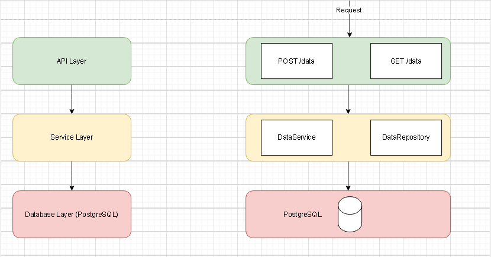
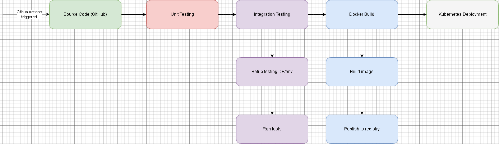

# Microservice Design Documentation

## High-Level Overview

This document details a microservice designed to handle high data volumes and ensure scalability and maintainability. It includes robust API endpoints for data creation and reading, supported by containerized deployment and Kubernetes for orchestration. 

1. **Introduction**
2. **Requirements and Goals**
3. **Architecture Overview**
4. **Technology Stack**
5. **Containerization**
6. **Kubernetes Deployment**
7. **CI/CD Pipeline**
8. **Testing Strategy**

## 1. Introduction
The two following functionalities are proposed for the microservice:
- **POST /data**: Accept and validate JSON input before persisting it to a database.
- **GET /data**: Retrieve and return stored data.

The micorservice is meant to implement a stateless REST architecture, with a layered design for separation of concerns.

## 2. Requirements and Goals

### Functional Requirements
- Accept JSON input via a REST API.
- Validate and persist the data.
- Retrieve stored data.

### Performance Goals
A key design goal is to maintain sub-500ms response times. On top of that, the system should be able to support billions of records with less than 10% performance degradation.

## 3. Architecture Overview

### **Diagram: Layered Architecture**


### Components
1. **API Layer**
   - Controllers that handle HTTP requests.
   - Performs validation of input data.
   - Formats responses.
2. **Service Layer**
   - Singletons that manage business logic
   - Interfaces with the database layer for CRUD operations.
3. **Database Layer**
   - Persistent storage for data.
   - Supports scalable read and write operations.

## 4. Technology Stack

### Justifications
- **Database:** PostgreSQL
  - Supports high scalability and ACID compliance.
  - Extensive support for indexing and query optimization.
- **Framework:** NestJS (Node.js)
  - Lightweight, non-blocking I/O.
  - Opinionated structure for maintainability
- **Containerization:** Docker
  - Ensures portability and consistency.
- **Orchestration:** Kubernetes
  - Supports horizontal scaling and fault tolerance.

## 5. Containerization

### Dockerfile
```Dockerfile
FROM node:18

WORKDIR /app

COPY package*.json ./

RUN npm install

COPY . .

RUN npm run build

CMD [ "npm", "run", "start:dev" ]
```

### Explanation
The Dockerfile utilizes a lightweight Node.js base image to ensure optimal performance and a small footprint. It begins by setting the working directory within the container to maintain a clean and organized structure. Package-related files are copied first to take advantage of Docker's caching mechanism, which allows dependencies to be installed efficiently using npm. The application source code is then copied into the container, followed by exposing the required application port to allow external access. Finally, the application is launched using the NestJS production script, ensuring that it runs as intended in a production environment.

## 6. Kubernetes Deployment

### Deployment Strategy
- Horizontal Pod Autoscaling based on CPU usage.
- PersistentVolumeClaims for database storage.

### Example YAML Files
#### Deployment
```yaml
apiVersion: apps/v1
kind: Deployment
metadata:
  name: data-service
spec:
  replicas: 3
  selector:
    matchLabels:
      app: data-service
  template:
    metadata:
      labels:
        app: data-service
    spec:
      containers:
      - name: data-service
        image: data-service:latest
        ports:
        - containerPort: 3000
```

#### Service
```yaml
apiVersion: v1
kind: Service
metadata:
  name: data-service
spec:
  type: LoadBalancer
  ports:
  - port: 80
    targetPort: 3000
  selector:
    app: data-service
```

## 7. CI/CD Pipeline

### Pipeline Diagram


### Steps
1. **Unit Testing:** Validate core functionalities.
2. **Integration Testing:** Validate API and database interactions.
3. **Docker Build:** Create and publish container image.
4. **Kubernetes Deployment:** Deploy the latest image.

## 8. Testing Strategy

### Unit Testing
- Focus: Input validation, database interaction.
- Tools: Jest, mocha.
- Focus less on overal coverage and more on critical paths.
- Ensure a good chunk of data validation scenarios are covered. Data consistency is extremely importante for this service.

### Integration Testing
- Validate API layer and database interactions.
- Have a script to populate the database with test data then call the API endpoints and ensure the data is returned as expected.
- Ensure that the database is in a clean state before and after tests.

### Performance Testing
- Simulate high concurrency using tools like JMeter.

### Manual Testing
- For a minimal set of endpoints as proposed in the requirements, manual testing can be done to add an extra layer of validation.


### Getting Started
**Project Overview:** Microservice for data ingestion and retrieval with scalability focus.

**Setup:**
1. Clone repo.
2. Run `docker-compose up`.
3. Access API at `http://localhost:3000`.

